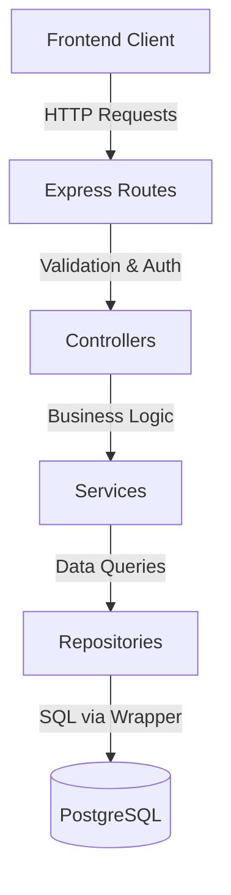

# Website Architecture and Learnings

This document serves as a comprehensive blueprint of the Virk Tools website architecture, the technologies used, and the critical lessons learned (especially regarding the [[PostgreSQL]] migration). Use this as a reference guide when generating or maintaining similar full-stack websites.

## 1. Tech Stack Overview

*   **Frontend**: [[React.js]] (via Vite)
*   **Styling**: Vanilla CSS (`index.css`), utilizing custom CSS variables for themes (e.g., `var(--color-primary)`).
*   **Backend**: [[Node.js]] with Express.js
*   **Database**: [[PostgreSQL]] (migrated from MySQL)
*   **Authentication**: JSON Web Tokens (JWT) stored in ==HTTP-only cookies==.
*   **PDF Generation**: `pdfkit` for generating dynamic product catalogs.

## 2. Backend Architecture

The backend follows a strict **Controller-Service-Repository** pattern to ensure a clean separation of concerns.

````markdown

````

*   **Routes (`/routes`)**: Define API endpoints and map them to specific controller functions. Also apply middlewares (like `authenticate`, `requireAdmin`, `rateLimiter`).
*   **Controllers (`/controllers`)**: Handle incoming HTTP requests, extract parameters/body data, call the appropriate Service layer, and return HTTP responses (JSON or files).
*   **Services (`/services`)**: Contain the core business logic. They process data, apply business rules, orchestrate multiple database calls if necessary, and interact with external libraries (like generating PDFs or Excel files).
*   **Repositories (`/repositories`)**: Handle all direct database interactions. They construct SQL queries and use the database wrapper to execute them. No business logic belongs here.

## 3. Database Translation Layer (`src/config/database.js`)

To facilitate the migration from MySQL to PostgreSQL without rewriting every single query string across the entire application, a custom wrapper was created around the `pg` pool.

This wrapper automatically intercepts standard SQL strings and performs runtime conversions:
1.  **Parameter Binding**: Converts MySQL's `?` placeholders into PostgreSQL's positional `$1`, `$2` syntax.
2.  **Backticks**: Replaces MySQL's backticks (`` `table_name` ``) with PostgreSQL's standard double quotes (`"table_name"`).
3.  **Insert IDs**: Automatically appends `RETURNING id` to `INSERT INTO` statements and maps the returned row to simulate MySQL's `insertId` behavior, allowing the repositories to remain unchanged.

## 4. Critical PostgreSQL Migration Learnings (Gotchas)

When migrating from MySQL to PostgreSQL, several strict type enforcements and syntax differences caused silent failures. Keep these in mind for future projects:

> [!warning] Boolean Strictness
> MySQL uses `TINYINT(1)` to represent booleans, meaning queries often use integers (`1` or `0`). PostgreSQL has a strict `BOOLEAN` type.
> *   **Wrong (MySQL)**: `WHERE is_published = 1 AND is_disabled = 0`
> *   **Correct (PostgreSQL)**: `WHERE is_published = true AND is_disabled = false`
> *   *Error thrown if missed*: `operator does not exist: boolean = integer`

> [!info] Aggregation Functions
> When aggregating multiple rows into a single string (like fetching all image URLs for a product), the functions differ.
> *   **MySQL**: `GROUP_CONCAT(pi.image_url SEPARATOR ',')`
> *   **PostgreSQL**: `STRING_AGG(pi.image_url, ',')`

> [!danger] Upsert Operations (Insert or Update)
> Handling cases where a row should be inserted, but updated if a unique key conflicts (e.g., Cart Items).
> *   **MySQL**: `INSERT INTO cart_items ... ON DUPLICATE KEY UPDATE quantity = ...`
> *   **PostgreSQL**: `INSERT INTO cart_items ... ON CONFLICT (cart_id, product_id) DO UPDATE SET quantity = ...`

> [!note] Complex Inserts (`INSERT INTO ... SET`)
> MySQL allows a non-standard `INSERT INTO table SET col1=val1, col2=val2` syntax. PostgreSQL requires the standard SQL syntax.
> *   **MySQL**: `INSERT INTO orders SET ?`
> *   **PostgreSQL**: `INSERT INTO orders (col1, col2) VALUES ($1, $2)`

## 5. Performance Optimization: Concurrent Batched HTTP Requests

> [!success] Performance Tip: Batching Requests
> **Scenario**: Generating a PDF catalog dynamically required fetching 300+ product images via HTTP from an external URL. Doing this sequentially (`for...of` loop with `await`) caused the generation to take 3-4 minutes, resulting in ==browser timeouts== (blank pages).
> 
> **Solution**: Pre-fetch all required external resources concurrently using `Promise.all()`. However, to prevent opening 300+ sockets simultaneously (which can crash Node.js or hit API rate limits), the array should be chunked into small batches (e.g., 20 items at a time).

```javascript
// Helper to chunk arrays
const chunkArray = (arr, size) => arr.length ? [arr.slice(0, size), ...chunkArray(arr.slice(size), size)] : [];

const productChunks = chunkArray(products, 20);
for (const chunk of productChunks) {
  // Process 20 images concurrently, wait, then process the next 20
  await Promise.all(chunk.map(async p => {
    // Fetch image buffer...
  }));
}
```

This optimization reduced the PDF generation time from ~4 minutes to ~4 seconds.

## 6. Frontend State & UI Best Practices

*   **Context API**: Used for global state like `AuthContext` (user sessions) and `CartContext` (shopping cart items).
*   **Dynamic Data vs Hardcoded Strings**: Always map dashboard metrics (like Total Products) directly from the API response rather than relying on hardcoded placeholder text (e.g., `100+`), as static text easily becomes misleading during production.
*   **Pagination vs Limits**: Always ensure backend API limits (e.g., `Math.min(1000, limit)`) are synchronized with frontend expectations. If an admin panel needs to display "All" products, the backend must be configured to allow lifting the hard cap for admin routes.

## 7. Deployment Architecture (Monorepo Split)

The project is a monorepo containing both the Express backend and the Vite/React frontend. However, to maximize performance and leverage free tiers effectively, the deployment is split across three cloud providers:

> [!info] The Separation of Concerns
> 1. **Frontend (Vercel)**: Vercel excels at static site generation and React hosting. The Vercel project is configured to watch the GitHub repo, but its **Root Directory** is set to `client/`. This tells Vercel to completely ignore the backend code and only build the frontend.
> 2. **Backend (Render.com)**: Render is designed for long-running Node.js processes. The backend is deployed as a Web Service on Render without any root directory setting (it runs `server.js` from the root). This avoids the 'Cold Start' latency limits and connection-pooling crashes that Serverless Functions (like Vercel API) suffer from.
> 3. **Database (Supabase)**: A remote PostgreSQL database handles all data persistence, providing a secure connection string to the Render backend.

> [!warning] CORS in a Split Deployment
> Because the frontend (Vercel) and backend (Render) live on different domains, Cross-Origin Resource Sharing (CORS) must be configured correctly on the backend.
> When using dynamic preview domains (like Vercel generates for each commit), hardcoding a single `CORS_ORIGIN` fails.
> **Solution**: The Express CORS middleware must be configured with a dynamic function to allow any origin ending in `.vercel.app`.

